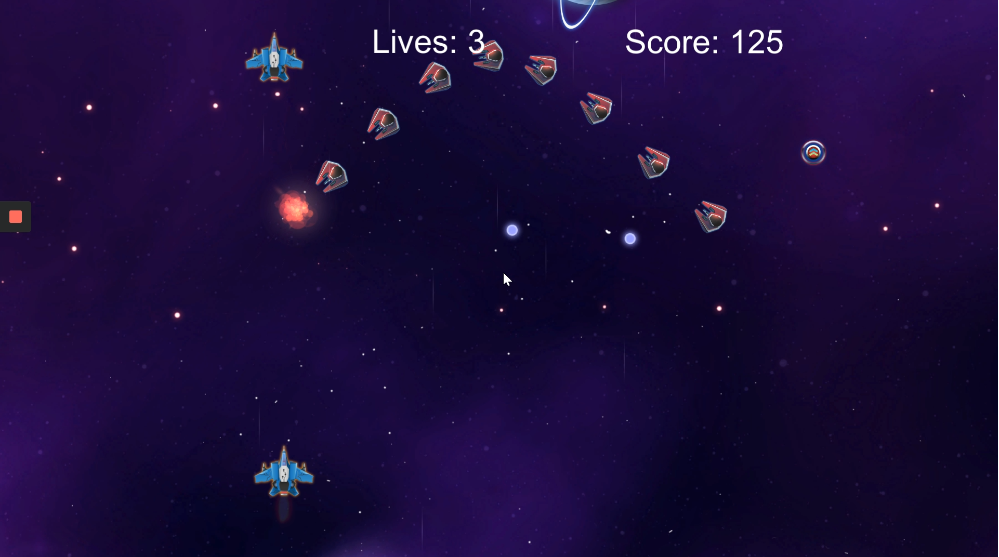

# 2D-Space-Shooter
 
A 2D game created as part of [XRTerra's AR & VR Developer Program](https://xrterra.com/programs/developer/).

## Description

This application is a simple 2D game for PC, inspired by the Space Shooter arcade game. The objective is to shoot at enemies which appear in waves, and not get shot or collide with any of the enemies. The player has three lives, after losing which, the game is over; the score increases every time an enemy is hit.

## Installation

An executable file can be found in the Builds folder.

## Built With

* [Unity](https://unity.com/)
  * Version: 2019.4.5f1
* [Microsoft Visual Studio Code](https://code.visualstudio.com/)
  * Version: 2019
  
## Development Setup

The system requirements can be found [here](https://docs.unity3d.com/Manual/system-requirements.html).

## Contact
 
Daniel Sharvaaya Dash - daniel.s.dash@gmail.com
 
Project Link: https://github.com/drash7/2D-Space-Shooter
 
## Contributing
 
I greatly appreciate any contribitions.
1. Fork the Project
2. Create your Feature Branch (`git checkout -b feature/CoolFeature`)
3. Commit your Changes (`git commit -m 'Add some CoolFeature'`)
4. Push to the Branch (`git push origin feature/CoolFeature`)
5. Open a Pull Request
